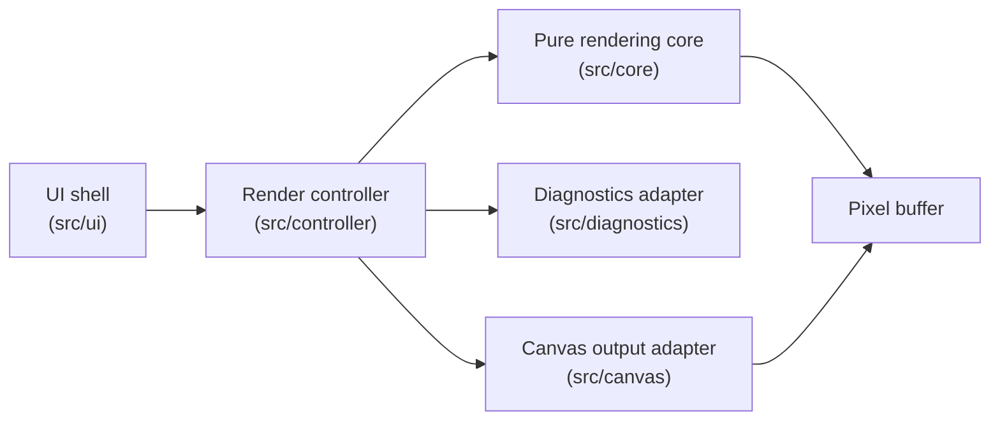

# Umbra

A didactic ray tracer — a small laboratory for learning how light becomes pixels by building a rendering engine from first principles.

Umbra walks through the path a photon takes to a pixel: vectors and rays, camera-ray generation, sphere intersection, surface normals, direct lighting, and Canvas 2D pixel output. Sprint 1 reaches a deterministic, directly-lit sphere scene (one camera, one sphere, one point light) rendered entirely on a browser Canvas — no Three.js, WebGL, or external math libraries.

## Architecture

The code follows strict dependency boundaries ([ADR-002](docs/adr/ADR-002-sprint-1-rendering-boundaries.md)): the pure rendering core never imports the DOM, Canvas, Vite, or UI types.



Inside the core, the render pipeline is a straight line of small, independently testable steps:

```text
vectors → rays → camera → sphere intersection → normal → direct lighting → pixel colors
```

| Layer | Directory | Owns |
| --- | --- | --- |
| UI shell | `src/ui/` | Dark laboratory page, Render control, lesson/pipeline copy |
| Render controller | `src/controller/` | Orchestrates one render pass; the only module depending on both core and Canvas |
| Pure core | `src/core/` | Vec3/Ray, camera, sphere, normal, background gradient, point light, `RenderRequest v0` |
| Canvas adapter | `src/canvas/` | The only module that touches Canvas 2D (`putImageData`) |
| Diagnostics adapter | `src/diagnostics/` | Render time, status, dimensions |

## Getting started

```bash
npm install
npm run dev          # dev server on http://localhost:5173
npm run test:run     # single-pass test run
npm run verify       # audit signatures → audit → typecheck → test → build (writes a report)
```

## Documentation

- [Project context](docs/PROJECT.md) — mission, scope, current state
- [Workspace model](docs/OSK.md) — where documentation belongs
- [Architecture overview](docs/knowledge/umbra-architecture-overview.md) — boundary rules
- [Engineering log](docs/engineering/ENGINEERING_LOG.md) — task / report / review index
- [ADR-001](docs/adr/ADR-001-typescript-vite-canvas-2d-baseline.md) · [ADR-002](docs/adr/ADR-002-sprint-1-rendering-boundaries.md)
